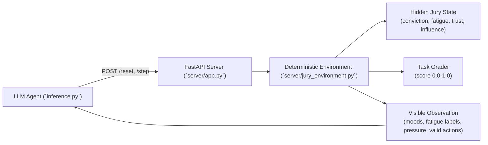
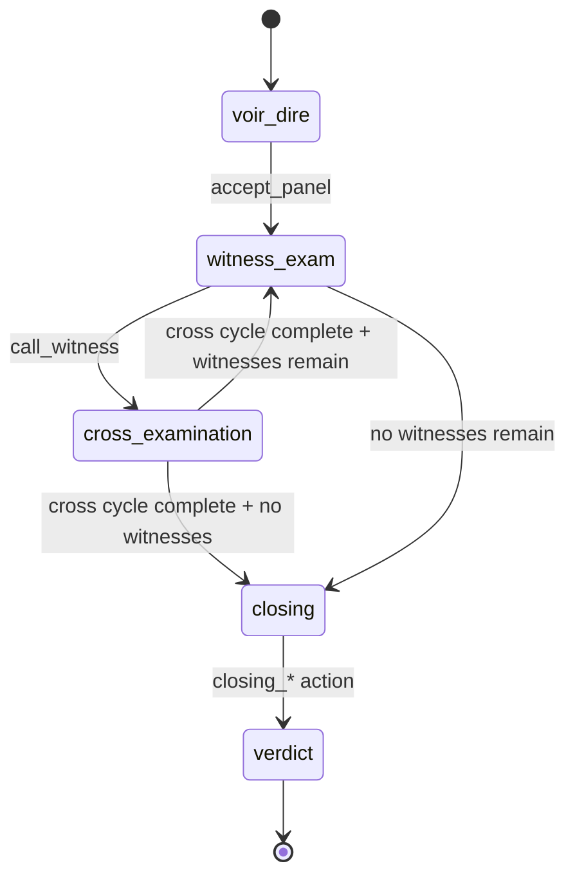
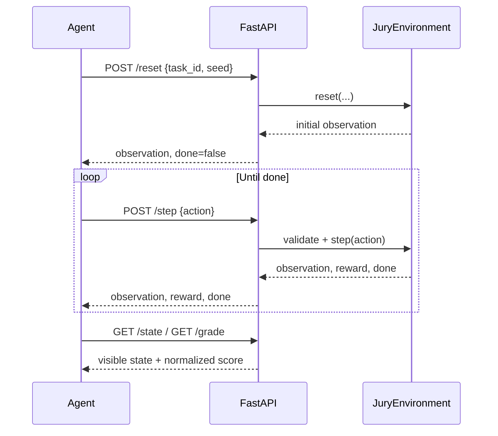

# Jury Consultant Environment

**OpenEnv hackathon submission — Neura Rangers**

---

## What is this?

An AI agent plays the role of a **jury consultant** — a real job in the legal industry.

In high-stakes trials, defense attorneys hire consultants to sit behind the table and advise on strategy: which jurors to remove, which witnesses to call, how hard to push during cross-examination, how to frame the final argument. The consultant cannot read minds — they only observe body language and jury reactions.

This environment simulates that exact problem. The AI must reduce a 12-person jury's collective belief in the defendant's guilt, making legal strategy decisions under uncertainty.

**Why is this interesting as an AI problem?** The agent never sees the true conviction levels. It only sees surface signals (mood, fatigue), just like a real consultant. Decisions are sequential and compound — a mistake in jury selection makes the witness phase harder.

---

## How it works

### System architecture



### The jury

12 jurors, each with a hidden psychological profile:

- **Conviction** — how guilty they believe the defendant is (0% to 100%, hidden)
- **Fatigue** — how worn out they are (grows over time)
- **Emotional temperature** — how much they react to emotional testimony
- **Procedural trust** — how much they respond to logic and evidence
- **Aggression sensitivity** — whether aggressive defense tactics backfire on them
- **Influence power** — how much this juror pulls others toward their view

The agent sees only indirect signals:

| What the agent sees | What it means |
|---------------------|---------------|
| Mood: `hostile` | Juror strongly believes defendant is guilty |
| Mood: `neutral` | Juror is undecided |
| Mood: `receptive` | Juror is open to the defense |
| Mood: `disengaged` | Juror is exhausted and tuned out |
| Fatigue: `low / medium / high` | How tired each juror is |
| Conviction pressure | Average guilt belief across all 12 jurors (aggregate, not individual) |

### The trial phases

The trial moves through four phases. At each phase, only certain actions are available:

| Phase | What happens | Available actions |
|-------|-------------|-------------------|
| **Voir dire** (jury selection) | Agent can remove biased jurors before trial starts | `probe_bias`, `challenge_juror`, `accept_panel` |
| **Witness examination** | Defense calls witnesses to present evidence | `call_witness`, `request_recess` |
| **Cross-examination** | Defense questions the prosecution's witness | `gentle_cross`, `aggressive_cross`, `impeach_witness`, `request_recess` |
| **Closing argument** | Final statement to the jury | `closing_emotional`, `closing_reasonable_doubt`, `closing_procedural` |



### How jurors influence each other

Jurors do not decide independently. A confident, high-conviction juror will gradually pull undecided jurors toward guilt. Each of the three scenarios has a different influence structure:

- **Reasonable Doubt**: Two "leader" jurors (seats 0 and 6) exert strong outward influence on the rest of the panel
- **Poisoned Panel**: Jurors 0, 1, and 2 form a tight cluster — they reinforce each other and pull the neutral middle toward conviction
- **The Impossible Case**: A chain — juror 0 influences juror 1, juror 1 influences juror 2, and so on down the panel

Removing a high-influence juror early can have cascading benefits.

### Scoring

The environment gives the agent a score from 0.0 to 1.0 after each step:

| Score | Meaning |
|-------|---------|
| 1.00 | Perfect outcome for the defense |
| 0.50 | Mixed result |
| 0.00 | Jury fully convinced of guilt |

---

## The three scenarios

### Scenario 1: Reasonable Doubt
**Case**: State v. Mercer — Armed Robbery

A mostly neutral jury with one stubborn holdout. Four credible witnesses available. Six peremptory challenges.

**Goal**: Drive average conviction below 35% (acquittal territory).

**What makes it hard**: Two leader jurors keep pulling others toward guilt. The agent needs to identify and remove them early.

---

### Scenario 2: Poisoned Panel
**Case**: State v. Aldridge — Corporate Fraud

Three jurors start at 90% conviction and form a tight influence cluster. The evidence is actually weak, but the jury does not know that.

**Goal**: Break the hostile cluster — all three biased jurors must fall below 55% conviction.

**What makes it hard**: The cluster's influence bleeds into neutral jurors continuously. The agent cannot just wait — the longer they sit, the more damage they do.

---

### Scenario 3: The Impossible Case
**Case**: State v. Harmon — Murder First Degree

Nine jurors start above 70% conviction. Only one witness is available. Fatigue grows faster than usual.

**Goal**: Force a hung jury. You need genuine split — some jurors deeply doubtful while others remain convinced.

**What makes it hard**: Simply reducing everyone's conviction equally does not work. The scoring function specifically rewards variance and the number of holdouts below 40%.

---

## What the AI agent does

The agent (powered by any OpenAI-compatible LLM) receives the current trial state as text and outputs a legal strategy decision in JSON format.

Example agent decision:
```json
{"action_type": "challenge_juror", "target_index": 3}
```

The agent keeps a rolling conversation history of the last 6 exchanges, so it can reason about how the trial has evolved.

If the LLM call fails, a deterministic fallback heuristic takes over: remove hostile jurors during voir dire, call witnesses, use gentle cross when jury is receptive.

---

## Reward function

The environment gives feedback every step, not just at the end:

```
reward = (0.5 - avg_conviction) x 2.0    # core signal: lower conviction = better
       - mean_fatigue x 0.30             # penalty: exhausted jury is unpredictable
       + mean_procedural_trust x 0.20    # bonus: build trust in the process
       - 0.50 if action was invalid      # penalty: wasted moves cost you

Final step bonus:
  + 1.0 if avg_conviction < 35%  (acquittal)
  + 0.3  if avg_conviction < 50%  (reasonable doubt)
```

---

## API

The environment runs as an HTTP server. Any agent can interact with it via these endpoints:

| Method | Endpoint | What it does |
|--------|----------|--------------|
| GET | `/health` | Check if server is running |
| POST | `/reset` | Start a new episode: `{"task_id": "reasonable_doubt", "seed": 42}` |
| POST | `/step` | Take one action: `{"action": {"action_type": "probe_bias"}}` |
| GET | `/state` | See current episode ID and step count |
| GET | `/schema` | JSON schemas for action and observation formats |
| GET | `/valid_actions` | List of actions legal in the current phase |

### Episode interaction flow



---

## Setup

```bash
# Install dependencies
pip install "openenv-core[core]>=0.2.1" fastapi uvicorn pydantic requests openai

# Start the environment server (Terminal 1)
uvicorn server.app:app --host 0.0.0.0 --port 7860

# Run the baseline agent (Terminal 2)
export HF_TOKEN=your_api_key_here
python3 inference.py
```

**Required environment variables:**

| Variable | Default | Description |
|----------|---------|-------------|
| `HF_TOKEN` | — | API key / HuggingFace token (**mandatory**) |
| `API_BASE_URL` | `https://router.huggingface.co/v1` | LLM API endpoint (OpenAI-compatible) |
| `MODEL_NAME` | `Qwen/Qwen2.5-72B-Instruct` | Model identifier |
| `LOCAL_IMAGE_NAME` | — | Docker image name (if using `from_docker_image()`) |

**Optional:**

| Variable | Default | Description |
|----------|---------|-------------|
| `ENV_URL` | `http://localhost:7860` | Environment server URL |
| `N_STEPS` | `20` | Max steps per episode |
| `TASK_ID` | all three tasks | Run a single task instead of all |

---

## Inference stdout format

`inference.py` emits exactly three line types to stdout, in order:

```
[START] task=<task_name> env=<benchmark> model=<model_name>
[STEP]  step=<n> action=<action_str> reward=<0.00> done=<true|false> error=<msg|null>
[END]   success=<true|false> steps=<n> score=<score> rewards=<r1,r2,...,rn>
```

- One `[START]` line at episode begin.
- One `[STEP]` line per step, immediately after `env.step()` returns.
- One `[END]` line after the episode ends — always emitted, even on exception.
- `reward` and `rewards` are formatted to 2 decimal places.
- `done` and `success` are lowercase booleans: `true` or `false`.
- `error` is the raw error string, or `null` if none.
- `action` uses `action_type` or `action_type:N` when a `target_index` is set.

**Example output (one task):**

```
[START] task=reasonable_doubt env=jury_env model=Qwen/Qwen2.5-72B-Instruct
[STEP] step=1 action=probe_bias reward=0.12 done=false error=null
[STEP] step=2 action=challenge_juror:0 reward=0.34 done=false error=null
[STEP] step=3 action=accept_panel reward=0.10 done=false error=null
[STEP] step=4 action=call_witness:0 reward=0.21 done=false error=null
[STEP] step=5 action=gentle_cross reward=0.18 done=false error=null
[STEP] step=6 action=closing_reasonable_doubt reward=1.10 done=true error=null
[END] success=true steps=6 score=0.72 rewards=0.12,0.34,0.10,0.21,0.18,1.10
```

---

## Docker

```bash
docker build -t jury-consultant .
docker run -e HF_TOKEN=your_key -p 7860:7860 jury-consultant
```

---

## Deploying to Hugging Face Spaces

```bash
git remote add space https://huggingface.co/spaces/your-username/jury-consultant
git push space main
```

Set `HF_TOKEN` as a Space secret in the dashboard.

---

## Technical spec

This environment implements the OpenEnv standard:

- `reset()` / `step()` / `state()` API with typed Pydantic models
- 3 tasks with independent graders returning 0.0–1.0
- Reproducible baselines via fixed random seeds
- Fully deterministic simulation (no LLM inside the environment itself)

See `openenv.yaml` for spec metadata.

---

## What an agent is learning

This environment is designed to develop and test several agent capabilities:

1. **Partial observability reasoning** — The agent sees mood labels and noisy conviction pressure, not true hidden state. It must infer underlying juror psychology from indirect signals.
2. **Sequential consequence planning** — Voir dire mistakes compound. Removing the wrong juror, or failing to remove a cluster leader, makes every subsequent phase harder.
3. **Resource management** — Peremptory challenges (3–6 depending on task) and witness slots are finite. Spending them poorly locks the agent into a disadvantaged position.
4. **Goal-directed strategy** — The `pending_goals` field surfaces open objectives each step. A strong agent checks this and prioritizes rather than acting randomly.
5. **Multi-objective trade-offs** — Each task rewards a different outcome pattern: uniform conviction reduction (easy), cluster disruption (medium), or conviction variance/holdouts (hard).

---

## Actions Reference

| Action | Phase | `target_index`? | Effect |
|--------|-------|-----------------|--------|
| `probe_bias` | voir_dire | No | Slightly boosts procedural trust for all jurors |
| `challenge_juror` | voir_dire | Yes (0–11) | Removes juror, replaces with neutral one — uses 1 challenge |
| `accept_panel` | voir_dire | No | Advances to witness examination phase |
| `call_witness` | witness_exam | Yes (0 = first available) | Puts witness on stand, starts cross-examination |
| `request_recess` | witness_exam, cross_examination | No | Reduces fatigue across all jurors; slight confidence cost |
| `gentle_cross` | cross_examination | No | Steady conviction reduction, no backfire risk |
| `aggressive_cross` | cross_examination | No | Larger conviction reduction but may backfire on sensitive jurors |
| `impeach_witness` | cross_examination | No | Damages witness credibility; conviction reduction scales with `cross_vulnerability` |
| `closing_emotional` | closing | No | Effective on jurors with high `emotional_temp` |
| `closing_procedural` | closing | No | Effective on jurors with high `procedural_trust` |
| `closing_reasonable_doubt` | closing | No | Flat –0.10 conviction for all jurors; most consistent |

---

## Observation Fields

| Field | Type | Description |
|-------|------|-------------|
| `phase` | str | Current trial phase |
| `step_index` | int | Steps taken so far |
| `conviction_pressure` | float | Noisy aggregate jury guilt signal (0=strong doubt, 1=certain guilty) |
| `juror_moods` | List[str] | 12 mood labels: hostile / neutral / receptive / disengaged |
| `juror_fatigue` | List[str] | 12 fatigue labels: low / medium / high |
| `remaining_challenges` | int | Peremptory challenges left |
| `remaining_witnesses` | List[str] | Names of unused witnesses |
| `current_witness` | str or null | Witness currently on the stand |
| `last_event` | str | Narrative of what just happened |
| `task_score` | float | Current normalized score in [0.02, 0.98] |
| `valid_actions` | List[str] | Actions legal in the current phase |
| `task_id` | str | Which scenario is running |
| `done` | bool | Whether the episode has ended |
| `reward` | float | Step reward |
| `case_summary` | str | 1–3 sentence case description |
| `charges` | List[str] | Formal charges against the defendant |
| `evidence` | List[dict] | Evidence items: `{"id","kind","strength","summary"}` |
| `witness_profiles` | List[dict] | Witness info: `{"name","type","theme","used"}` |
| `goals` | List[dict] | Strategic goals with completion status |
| `pending_goals` | List[dict] | Subset of goals not yet completed — focus here |
| `coalition_hint` | dict or null | `poisoned_panel` only: `{"size","seats","influence_style"}` |
| `cross_actions_remaining` | int | Actions left before cross-examination auto-advances |
| `jury_patience` | float | 0–1 patience meter. Decays when the same action is repeated; recovers on action variety. Multiplies final score via `0.70 + 0.30 × patience`. |
| `juror_profiles_visible` | List[dict] | Per-juror: `{"index","mood","fatigue","notes"}` |
| `reward_breakdown` | dict | Informational: `avg_conviction`, `conviction_pressure_component`, `fatigue_penalty_component`, `trust_bonus_component` |
| `phase_deadline_steps_remaining` | int or null | `the_impossible_case` only: steps of context until deadline |

---

## Reward Breakdown

Each step reward is composed of:

| Component | Formula | Notes |
|-----------|---------|-------|
| conviction_pressure_component | `(0.5 − avg_conviction) × 2.0` | Core signal. Below 0.5 is positive. |
| fatigue_penalty_component | `− mean_fatigue × 0.30` | Always a cost; fatigued jury is unpredictable. |
| trust_bonus_component | `mean_procedural_trust × 0.20` | Small bonus for building faith in the process. |
| action_effect | Varies by action | The direct effect of the chosen action on top of base. |
| patience_multiplier | `0.70 + 0.30 × jury_patience` | Penalty for exploitative repetition. Repeating the same action consecutively decays patience (−0.10 per consecutive repeat, min 0.20). Score is multiplied by this at the end. patience=1.0 → ×1.0 (unaffected); patience=0.20 → ×0.76. |

Terminal bonuses (applied in closing):
- **+1.0** if average conviction < 0.35 (acquittal territory)
- **+0.30** if average conviction < 0.50 (reasonable doubt territory)

---

## Case Backstories

Each task has a full narrative context. Here is the complete backstory per case — useful for building richer prompts.

---

### Task 1: State v. Mercer — Reasonable Doubt (Easy)

**The defendant:** Marcus Mercer, 34, warehouse worker. No prior record. Accused of robbing a convenience store at gunpoint on the night of March 14th.

**What happened:** At 9:47 PM, a masked individual robbed the store at gunpoint, taking $340 from the register. Store clerk Maria Santos called 911 and identified Mercer from a photo lineup three days later, saying she was "80% sure." Police found a partial fingerprint on the register — too degraded for a definitive match.

**The defense position:** Mercer was clocked in at his warehouse job 14 miles away at the time of the robbery. His employer Dr. Kim holds the time-card records. The defense argues Santos's ID is unreliable (dim lighting, stress, brief contact) and the fingerprint is inconclusive.

**Key witnesses:**
| Witness | Role | Strategic note |
|---------|------|---------------|
| **Dr. Kim** | Mercer's employer; confirms warehouse time-card showing he was on shift during the robbery. | Your strongest asset — call early. Prosecution will challenge the time-card system's accuracy. |
| **Dr. Chen** | Forensic expert; argues the partial fingerprint is too degraded for a reliable match. | Credible but dry. Works best on procedurally-minded jurors. |
| **Maria Santos** | Store clerk; the prosecution's eyewitness and anchor of the case. | Cross her carefully — her stress-impaired perception and lighting conditions are exploitable, but aggressive cross can backfire. |
| **Tom Mercer Sr.** | Marcus's father; character reference. | Low evidentiary weight. Use only if jury trust is already high. |

**Winning condition:** Drive average jury conviction below 35% before closing. Challenge the two leader jurors (seats 0 and 6) early — they pull the whole panel.

---

### Task 2: State v. Aldridge — Poisoned Panel (Medium)

**The defendant:** James Aldridge Jr., 51, CFO of Aldridge & Partners financial advisory firm. Accused of wire fraud and embezzlement — allegedly siphoning $2.3 million to an offshore account over 18 months.

**What happened:** Internal auditors flagged 14 unauthorized wire transfers. The prosecution's star witness, Rachel Thorn — a former compliance officer Aldridge fired six months earlier — claims she watched him personally authorize the transfers in a private meeting. Bank records show systematic patterns that a forensic accountant calls "conclusive."

**The complication:** Three jurors (seats 0, 1, 2) have personal connections to financial fraud victims. They entered deliberations convinced of guilt and actively influence the nine neutral jurors around them. Their influence cluster is the real enemy — not the evidence.

**The defense position:** The transfers were authorized by a third party using a forged signature. Dr. Osei (handwriting expert) can challenge the signatures. Prof. Hammond disputes the forensic accounting methodology. Rachel Thorn has a personal grievance — she's not a neutral witness.

**Key witnesses:**
| Witness | Role | Strategic note |
|---------|------|---------------|
| **Prof. Hammond** | Forensic accountant; disputes the prosecution's interpretation of the bank records. | Counter-narrative to the prosecution's "conclusive" claim. Call early before the cluster locks in neutral jurors. |
| **Rachel Thorn** | Whistleblower; prosecution's eyewitness to the alleged transfers. | Cross-examine aggressively — her firing six months prior is a credibility bomb. High risk, high reward. |
| **Dr. Osei** | Handwriting expert; argues the signatures on transfer approvals were forged. | Specific, technical. Pairs well with Hammond to create a coherent alternative theory. |
| **James Aldridge Sr.** | Character witness. | Low weight with biased jurors. Skip if resources are limited. |

**Winning condition:** Break the three-juror hostile cluster (all below 0.55 conviction) while keeping neutral jurors from being contaminated (none above 0.70). Challenge at least 2 of the 3 cluster seats in voir dire.

---

### Task 3: State v. Harmon — The Impossible Case (Hard)

**The defendant:** Devon Harmon, 28, former restaurant manager. Charged with first-degree murder in the death of a business partner.

**Why it's "impossible":** The prosecution has DNA at the scene, two independent eyewitnesses, and a documented history of conflict between Harmon and the victim. Nine of twelve jurors begin voir dire already convinced of guilt. The math is against acquittal.

**The only viable goal:** Create a hung jury. You need at least 3 holdouts with conviction below 0.40. Do not try to win outright — the ceiling score for this task is intentionally ~0.45.

**What happened:** Victor Lau, Harmon's business partner, was found dead in their shared restaurant after a confrontation documented on security footage. Harmon's DNA was on the victim's jacket. Two witnesses place Harmon at the scene an hour before the estimated time of death. Harmon claims he left before the incident and the DNA transfer happened during an earlier argument.

**Key witnesses:**
| Witness | Role | Strategic note |
|---------|------|---------------|
| **Dr. Patel** | Forensic scientist; argues the DNA sample shows signs of cross-contamination during collection. | Your only witness. Call before step 12 — the jury's patience with the defense narrative erodes fast. Aggressive cross after calling them maximizes the split. |

**Winning condition:** Not acquittal. Get 3+ jurors below 0.40 conviction and 4+ below 0.50. Use your 3 peremptory challenges strategically — don't waste them all. The faster you create variance in the panel, the better.

---

## Why "The Impossible Case" Is Designed to Be Hard

The scenario is not meant to be solvable with a high score. A skilled agent should achieve ~0.15–0.45 — the ceiling is intentionally low.

The scoring function does **not** reward simply reducing conviction. It rewards **variance** and **holdouts** — the pattern of a hung jury. An agent that drives all jurors to 0.45 uniformly will score lower than one that creates a genuine split: three jurors below 0.40 while others stay high.

Combined constraints that make this intentionally difficult:
- 9 of 12 jurors start above 70% conviction
- Only **1 witness** available (Dr. Patel)
- Only **3 challenges** (vs 6 in easier tasks)
- **Fatigue rate 2×** faster (0.06/step vs 0.03)
- High aggression sensitivity — aggressive cross is risky
- Low procedural trust — procedural closing is weak
- Chain influence topology propagates conviction forward

This task tests whether an agent can recognize that the goal is differentiated splitting, not uniform reduction.

---

## Expected Score Ranges

Based on benchmark runs across seeds 42, 43, 44:

| Task | Heuristic Policy | Strong LLM Agent |
|------|-----------------|-----------------|
| `reasonable_doubt` | 0.40–0.65 | 0.60–0.85 |
| `poisoned_panel` | 0.15–0.40 | 0.30–0.65 |
| `the_impossible_case` | 0.05–0.25 | 0.15–0.45 |

---

## Reproducibility Guarantees

This environment is fully deterministic given the same `task_id` and `seed`:

| What is fixed | How |
|---------------|-----|
| Initial juror convictions | Fixed per `task_id` — set in `_make_task()` with a task-specific RNG seed (42 / 99 / 137) |
| Witness pool and credibility | Fixed per `task_id` — same task always has same witnesses |
| Social influence topology | Fixed per `task_id` — leader, cluster, and chain structures are hardcoded per task |
| Initial juror `emotional_temp` | Varies per episode `seed` — this is the only seed-controlled variable |
| Replacement jurors (from challenge) | Varies per episode `seed` — replacement conviction drawn from seeded RNG |

This means: different seeds produce slightly different juror reactivity, but all structural properties (initial convictions, influence network, witness pool) are identical across seeds for the same task.

**Benchmark verification:** Run the heuristic agent twice with identical seeds and compare scores — results will match exactly, confirming full simulation determinism.
