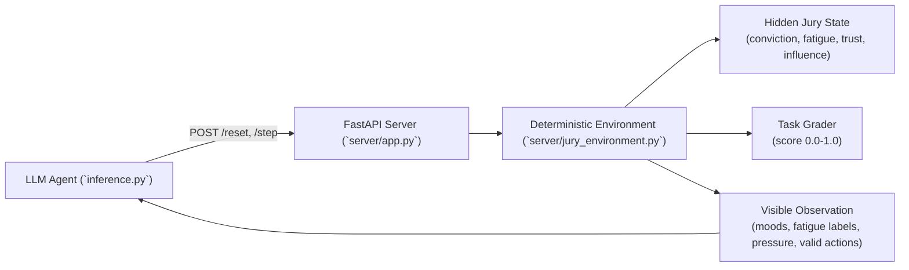
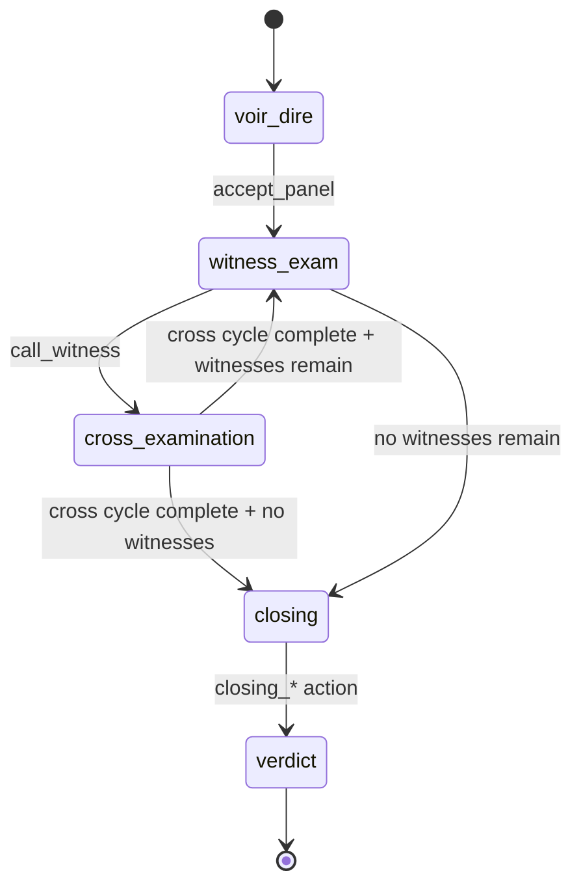
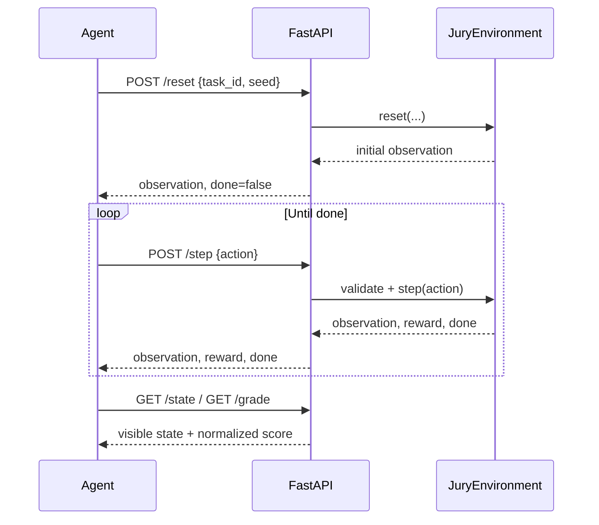

# Jury Consultant Environment

**OpenEnv hackathon submission — Neura Rangers**

---

## What is this?

An AI agent plays the role of a **jury consultant** — a real job in the legal industry.

In high-stakes trials, defense attorneys hire consultants to sit behind the table and advise on strategy: which jurors to remove, which witnesses to call, how hard to push during cross-examination, how to frame the final argument. The consultant cannot read minds — they only observe body language and jury reactions.

This environment simulates that exact problem. The AI must reduce a 12-person jury's collective belief in the defendant's guilt, making legal strategy decisions under uncertainty.

**Why is this interesting as an AI problem?** The agent never sees the true conviction levels. It only sees surface signals (mood, fatigue), just like a real consultant. Decisions are sequential and compound — a mistake in jury selection makes the witness phase harder.

---

## How it works

### System architecture



### The jury

12 jurors, each with a hidden psychological profile:

- **Conviction** — how guilty they believe the defendant is (0% to 100%, hidden)
- **Fatigue** — how worn out they are (grows over time)
- **Emotional temperature** — how much they react to emotional testimony
- **Procedural trust** — how much they respond to logic and evidence
- **Aggression sensitivity** — whether aggressive defense tactics backfire on them
- **Influence power** — how much this juror pulls others toward their view

The agent sees only indirect signals:

| What the agent sees | What it means |
|---------------------|---------------|
| Mood: `hostile` | Juror strongly believes defendant is guilty |
| Mood: `neutral` | Juror is undecided |
| Mood: `receptive` | Juror is open to the defense |
| Mood: `disengaged` | Juror is exhausted and tuned out |
| Fatigue: `low / medium / high` | How tired each juror is |
| Conviction pressure | Average guilt belief across all 12 jurors (aggregate, not individual) |

### The trial phases

The trial moves through four phases. At each phase, only certain actions are available:

| Phase | What happens | Available actions |
|-------|-------------|-------------------|
| **Voir dire** (jury selection) | Agent can remove biased jurors before trial starts | `probe_bias`, `challenge_juror`, `accept_panel` |
| **Witness examination** | Defense calls witnesses to present evidence | `call_witness`, `request_recess` |
| **Cross-examination** | Defense questions the prosecution's witness | `gentle_cross`, `aggressive_cross`, `impeach_witness`, `request_recess` |
| **Closing argument** | Final statement to the jury | `closing_emotional`, `closing_reasonable_doubt`, `closing_procedural` |



### How jurors influence each other

Jurors do not decide independently. A confident, high-conviction juror will gradually pull undecided jurors toward guilt. Each of the three scenarios has a different influence structure:

- **Reasonable Doubt**: Two "leader" jurors (seats 0 and 6) exert strong outward influence on the rest of the panel
- **Poisoned Panel**: Jurors 0, 1, and 2 form a tight cluster — they reinforce each other and pull the neutral middle toward conviction
- **The Impossible Case**: A chain — juror 0 influences juror 1, juror 1 influences juror 2, and so on down the panel

Removing a high-influence juror early can have cascading benefits.

### Scoring

The environment gives the agent a score from 0.0 to 1.0 after each step:

| Score | Meaning |
|-------|---------|
| 1.00 | Perfect outcome for the defense |
| 0.50 | Mixed result |
| 0.00 | Jury fully convinced of guilt |

---

## The three scenarios

### Scenario 1: Reasonable Doubt
**Case**: State v. Mercer — Armed Robbery

A mostly neutral jury with one stubborn holdout. Four credible witnesses available. Six peremptory challenges.

**Goal**: Drive average conviction below 35% (acquittal territory).

**What makes it hard**: Two leader jurors keep pulling others toward guilt. The agent needs to identify and remove them early.

---

### Scenario 2: Poisoned Panel
**Case**: State v. Aldridge — Corporate Fraud

Three jurors start at 90% conviction and form a tight influence cluster. The evidence is actually weak, but the jury does not know that.

**Goal**: Break the hostile cluster — all three biased jurors must fall below 55% conviction.

**What makes it hard**: The cluster's influence bleeds into neutral jurors continuously. The agent cannot just wait — the longer they sit, the more damage they do.

---

### Scenario 3: The Impossible Case
**Case**: State v. Harmon — Murder First Degree

Nine jurors start above 70% conviction. Only one witness is available. Fatigue grows faster than usual.

**Goal**: Force a hung jury. You need genuine split — some jurors deeply doubtful while others remain convinced.

**What makes it hard**: Simply reducing everyone's conviction equally does not work. The scoring function specifically rewards variance and the number of holdouts below 40%.

---

## What the AI agent does

The agent (powered by any OpenAI-compatible LLM) receives the current trial state as text and outputs a legal strategy decision in JSON format.

Example agent decision:
```json
{"action_type": "challenge_juror", "target_index": 3}
```

The agent keeps a rolling conversation history of the last 6 exchanges, so it can reason about how the trial has evolved.

If the LLM call fails, a deterministic fallback heuristic takes over: remove hostile jurors during voir dire, call witnesses, use gentle cross when jury is receptive.

---

## Reward function

The environment gives feedback every step, not just at the end:

```
reward = (0.5 - avg_conviction) x 2.0    # core signal: lower conviction = better
       - mean_fatigue x 0.30             # penalty: exhausted jury is unpredictable
       + mean_procedural_trust x 0.20    # bonus: build trust in the process
       - 0.50 if action was invalid      # penalty: wasted moves cost you

Final step bonus:
  + 1.0 if avg_conviction < 35%  (acquittal)
  + 0.3  if avg_conviction < 50%  (reasonable doubt)
```

---

## API

The environment runs as an HTTP server. Any agent can interact with it via these endpoints:

| Method | Endpoint | What it does |
|--------|----------|--------------|
| GET | `/health` | Check if server is running |
| POST | `/reset` | Start a new episode: `{"task_id": "reasonable_doubt", "seed": 42}` |
| POST | `/step` | Take one action: `{"action": {"action_type": "probe_bias"}}` |
| GET | `/state` | See current episode ID and step count |
| GET | `/schema` | JSON schemas for action and observation formats |
| GET | `/valid_actions` | List of actions legal in the current phase |

### Episode interaction flow



---

## Setup

```bash
# Install dependencies
pip install "openenv-core[core]>=0.2.1" fastapi uvicorn pydantic requests openai

# Start the environment server (Terminal 1)
uvicorn server.app:app --host 0.0.0.0 --port 7860

# Run the baseline agent (Terminal 2)
export HF_TOKEN=your_api_key_here
python3 inference.py
```

**Required environment variables:**

| Variable | Description |
|----------|-------------|
| `HF_TOKEN` | API key for the LLM |
| `API_BASE_URL` | LLM API endpoint (defaults to OpenAI) |
| `MODEL_NAME` | Model to use (defaults to `gpt-4o`) |

Optional:
- `ENV_URL` — defaults to `http://localhost:7860`
- `N_STEPS` — max steps per task (default 20)

---

## Docker

```bash
docker build -t jury-consultant .
docker run -e HF_TOKEN=your_key -p 7860:7860 jury-consultant
```

---

## Deploying to Hugging Face Spaces

```bash
git remote add space https://huggingface.co/spaces/your-username/jury-consultant
git push space main
```

Set `HF_TOKEN` as a Space secret in the dashboard.

---

## Technical spec

This environment implements the OpenEnv standard:

- `reset()` / `step()` / `state()` API with typed Pydantic models
- 3 tasks with independent graders returning 0.0–1.0
- Reproducible baselines via fixed random seeds
- Fully deterministic simulation (no LLM inside the environment itself)

See `openenv.yaml` for spec metadata.
